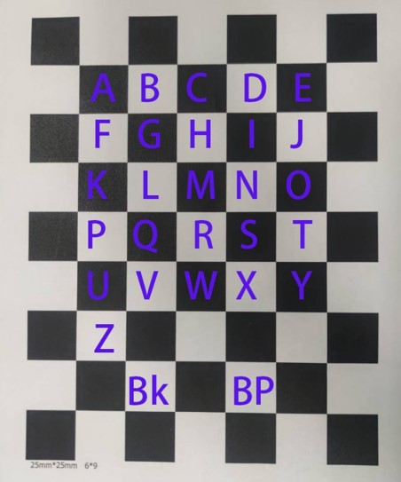

# <mark><big>Hand Detect Virtual Keyboard -- HDKB</big><mark>
  
---
  
## 项目介绍（Project Introduction）

***本产品基于ShuffleNet手部关键点识别， 利用realsense d455深度相机计算深度， 构建三维坐标系， 实现虚拟键盘功能。***  

----

## 环境依赖(environment dependent)
##### Python 3.7/3.10
```
cvzone == 1.4.1  
numpy == 1.22.1  
pyautogui == 0.9.53  
opencv == 0.4.1  
pyrealsense2 == 2.53.1.4623
PyTorch >= 1.5.1
opencv-python
```

-----

## 设备要求(equipment requirements) 

+ **intel realsense d455**
+ **6×8大小棋盘格， 要求格子边长为2.5cm**  
+ **GPU >= GTX750**

-----

## 棋盘格按键对应(checkerboard)

  


-----

## 使用方法(Instructions)

1. 安装好软件包  
2. 连接realsense d455摄像头  
3. 运行main.py  
4. 将摄像头对准棋盘格，最好将摄像头拜访在距离棋盘格30cm外，并且完全出现在图像中，摄像头和棋盘格平面成45°角最佳。  
5. 按下 s 获取相机外参数  
6. 然后可以在棋盘格上进行打字  
7. 如果棋盘格发生偏移，使棋盘格完全出现在图像中，按下 n 可以重新获得外参数  
8. 按下 s 退出程序  

----

## 演示示例


----

## 作者&联系方式（Author & Contact）

##### ***Allen Lee***
+ 220245562@seu.edu.cn  
##### ***John Yu*** 
+ 220245645@seu.edu.cn
##### ***Rocket L*** 
+ 2858865887@qq.con

---